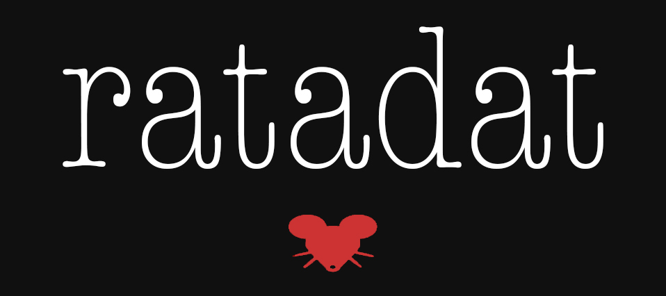

<p align="center">
  
</p>

<p align="center">
  A full-stack web application for detecting and predicting fashion resale trend cycles, delivering actionable market insight for vintage and secondhand sellers, and classifying vintage garments by era. Built with React, FastAPI, SQLite, and Claude AI.
</p>

<p align="center">
  
  
  
  
  
  
</p>

---

## Table of Contents

- [Overview](#overview)
- [Features](#features)
- [Guest Access](#guest-access)
- [Tech Stack](#tech-stack)
- [Getting Started](#getting-started)
  - [Prerequisites](#prerequisites)
  - [Installation](#installation)
  - [Environment Variables](#environment-variables)
- [Usage](#usage)
- [Data Sources & Scheduling](#data-sources--scheduling)
- [Running Tests](#running-tests)
- [Project Structure](#project-structure)
- [Documentation](#documentation)
- [Contributing](#contributing)

---

## Overview

ratadat monitors fashion resale markets in real time — aggregating search demand, pricing, and social signals — and turns raw data into trend scores, lifecycle stage labels, 30-day forecasts, and sourcing recommendations. A second module lets users browse all 24 fashion eras and classify any vintage garment by era using text descriptors and/or uploaded photos, powered by Claude Sonnet 4.6's vision API.

---

## Features

### Trend Forecast
- **Top 10 Trends** — Ranked keywords by composite score, updated every 6 hours from live marketplace and social data
- **Trend Lifecycle Detection** — Automatically labels each keyword's market stage: Emerging → Accelerating → Peak → Saturation → Decline → Dormant → Revival
- **Market Insight** — Per-keyword breakdown: search volume over time, average resale price, sales velocity, price volatility, sell-through rate, and regional demand heatmaps (US states + global)
- **Rising Challengers** — Keywords ranked 11+ with upward momentum, flagged for early sourcing opportunity
- **30-Day Ranking Forecast** — AI-powered projection of where a keyword is headed
- **Keyword Tracking** — Add any keyword to a personal tracked list; get an on-demand scrape immediately
- **Compare Tool** — Side-by-side time-series comparison of up to 6 keywords
- **Sourcing Cards** — Live eBay/Etsy/Poshmark listings pulled per keyword with images and price context
- **Stella Chatbot** — In-app AI assistant (Claude Haiku 4.5) that interprets trend scores, explains lifecycle stages, and answers sourcing questions in context

### Vintage
- **Era Browser** — Style profiles, moodboard photos, and market pricing for all 24 eras from the 1700s through the 2000s
- **Garment Classifier** — Upload up to 10 photos and/or select fabric, print, silhouette, and aesthetic descriptors; Claude Sonnet 4.6 returns a primary era match with confidence score, reasoning, matching features, and two alternate eras

---

## Guest Access

All browsing features are available without an account. Guests can:

- Search trends and view the Top 10
- Open per-keyword detail panels (volume chart, price, social signals, sourcing cards)
- Use the Compare tool with any keywords
- Browse the Vintage era explorer
- Run garment classifications

Two actions require sign-in:

- **Track tab** — saving tracked keywords across sessions
- **Classify tab** — saving classification history across sessions

A persistent sign-in prompt is shown on the Track, Compare, and Classify tabs for unauthenticated users.

---

## Tech Stack

| Layer | Technology |
|-------|------------|
| Frontend | React 18 + Vite, Recharts, plain CSS |
| Backend | FastAPI (Python 3.11), APScheduler |
| Database | SQLite (WAL mode, persisted via Docker volume) |
| Auth | JWT (python-jose) + bcrypt, CSV user store |
| AI | Anthropic API — Claude Sonnet 4.6 (classifier + forecasting) · Claude Haiku 4.5 (Stella chatbot) |
| Deployment | Docker Compose — Nginx (frontend) + Uvicorn (backend) |

---

## Getting Started

### Prerequisites

- [Docker](https://docs.docker.com/get-docker/) and Docker Compose
- API keys for eBay, Etsy, and Anthropic (required); Reddit and Google optional

### Installation

```bash
git clone <repo-url>
cd cs667

# Copy the example env file and fill in your keys
cp .env.example .env

# Build and start both containers
docker compose up --build
```

The app will be available at **http://localhost**.

To stop:

```bash
docker compose down
```

### Environment Variables

Create a `.env` file at the project root with the following:

| Variable | Required | Description |
|----------|----------|-------------|
| `JWT_SECRET` | Yes | Secret key for signing JWT tokens |
| `ANTHROPIC_API_KEY` | Yes | Powers the garment classifier and Stella chatbot |
| `EBAY_APP_ID` | Yes | eBay Browse API — pricing and listing data |
| `EBAY_CERT_ID` | Yes | eBay OAuth credentials |
| `ETSY_API_KEY` | Yes | Etsy v3 API — listing and price data |
| `REDDIT_CLIENT_ID` | Optional | Reddit mention tracking |
| `REDDIT_CLIENT_SECRET` | Optional | Reddit mention tracking |
| `PEXELS_API_KEY` | Optional | Fallback product images |
| `GOOGLE_CSE_API_KEY` | Optional | Google Custom Search images |
| `GOOGLE_CSE_CX` | Optional | Google Custom Search engine ID |

---

## Usage

1. **Open http://localhost** — the app loads with seed keyword data visible immediately (no account required)
2. **Search a keyword** in the search bar to trigger an on-demand scrape and see its trend detail
3. **Sign up** to save keywords to your personal Track list and retain classify history across sessions
4. **Switch to Vintage** via the nav toggle to browse eras or run a garment classification
5. **Use Compare** to add up to 6 keywords and view their volume and score side by side

---

## Data Sources & Scheduling

| Source | Data Collected |
|--------|----------------|
| Google Trends | Search volume over time, US state + global country breakdowns |
| eBay Browse API | Average sold price, listing count |
| Etsy API v3 | Average price, listing count |
| Poshmark (HTML) | Listing count, prices |
| Reddit JSON API | Mention count across 6 fashion subreddits |
| Google News RSS | News mention count |

Background jobs run via APScheduler:

| Job | Interval |
|-----|----------|
| Scrape all sources + compute scores | Every 6 hours |
| Google Trends dedicated scrape | Every 8 hours (+5 min offset) |
| Catchup Google Trends (fill gaps after rate-limit) | Every 8 hours (+3 hour offset) |
| Auto-discover new keywords | Every 24 hours |
| Expire stale user-added keywords | Every 24 hours |
| Refine keyword scale classifications | Every 7 days |

---

## Running Tests

Tests live in `tests/` and run inside the backend container. All external API calls are mocked.

```bash
# Install pytest (once per container build)
docker exec cs667-backend-1 pip install pytest

# Run the full test suite
docker exec -w /app cs667-backend-1 python -m pytest tests/ -v
```

**88 tests, 0 failures** — covering auth, chat, all scrapers, trends API, and vintage API.

---

## Project Structure

```
cs667/
├── frontend/
│   ├── src/
│   │   ├── components/        # React components (Dashboard, TrendDetail, VintageExplorer, GarmentClassifier, ...)
│   │   ├── hooks/useAuth.jsx  # JWT auth context + openSignIn(msg)
│   │   └── services/api.js    # Axios instance with Bearer token interceptor
│   ├── nginx.conf
│   └── Dockerfile
├── backend/
│   ├── app/
│   │   ├── auth/              # Register, login, JWT validation
│   │   ├── trends/            # Trend scoring, keyword management, sourcing, forecasting
│   │   ├── compare/           # Comparison list (auth) + public-data endpoint (guest)
│   │   ├── chat/              # Stella chatbot (Claude Haiku 4.5)
│   │   ├── vintage/           # Era browser, garment classifier (Claude Sonnet 4.6)
│   │   ├── scrapers/          # One module per data source
│   │   ├── scheduler/         # APScheduler job definitions
│   │   ├── database.py        # SQLite schema + migrations + connection helper
│   │   └── config.py          # Pydantic settings from env vars
│   ├── data/                  # Persisted via Docker volume
│   │   ├── trends.db
│   │   ├── users.csv
│   │   └── seed_keywords.json
│   └── Dockerfile
├── tests/                     # pytest suite (88 tests, all external APIs mocked)
├── docs/
│   ├── CREATE/SYSTEM.md       # Full architecture documentation + Mermaid diagrams
│   └── logo.jpg
├── docker-compose.yml
└── README.md
```

---

## Documentation

Full architecture documentation — including Mermaid diagrams for the system architecture, data pipeline, database schema, frontend routing, and classifier sequence — is in [`docs/CREATE/SYSTEM.md`](docs/CREATE/SYSTEM.md).

---

## Contributing

This project is a capstone academic project. Feedback and issues are welcome via GitHub Issues.
