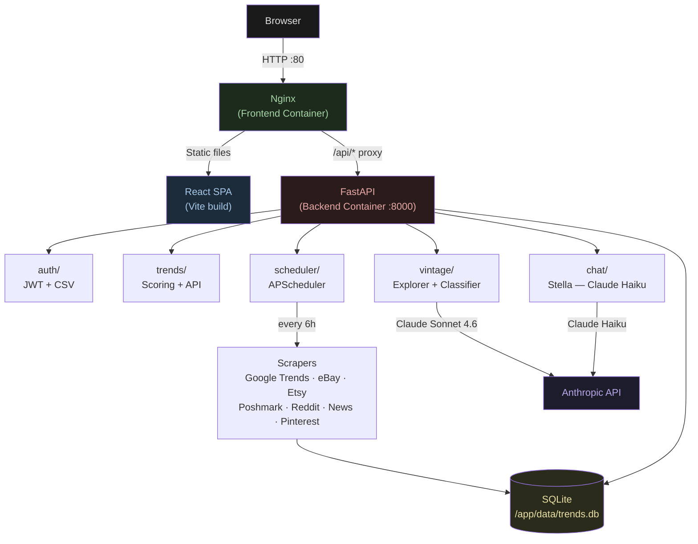
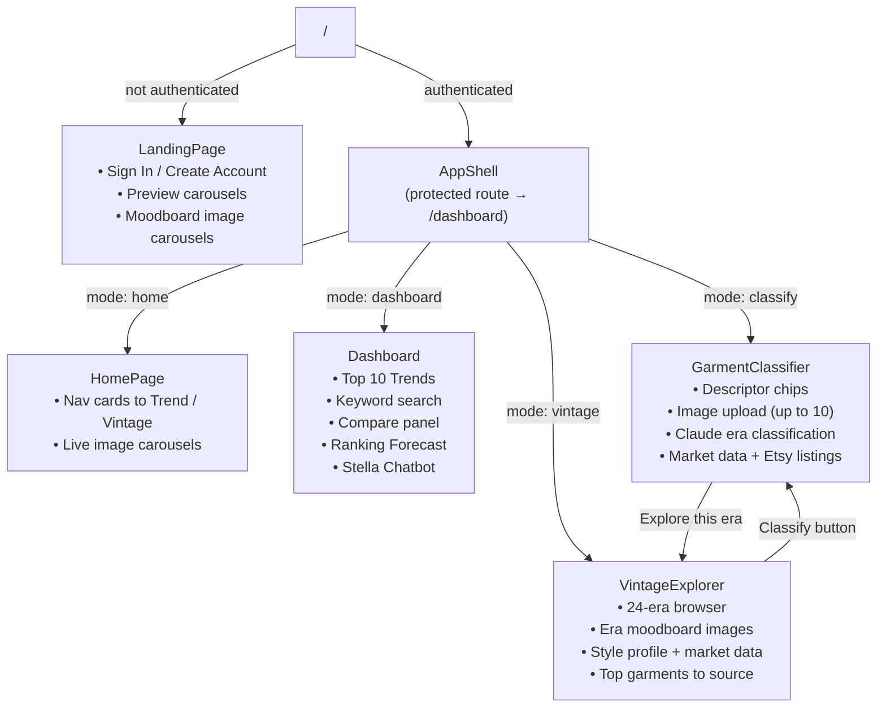
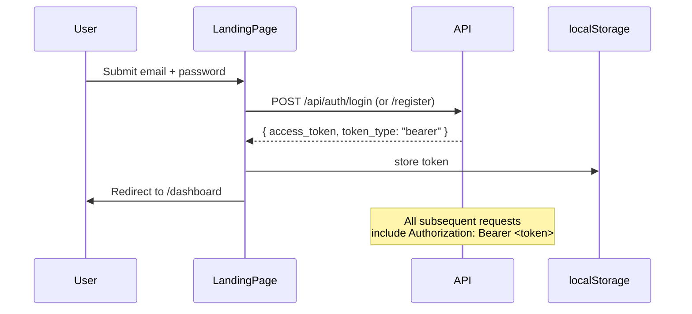
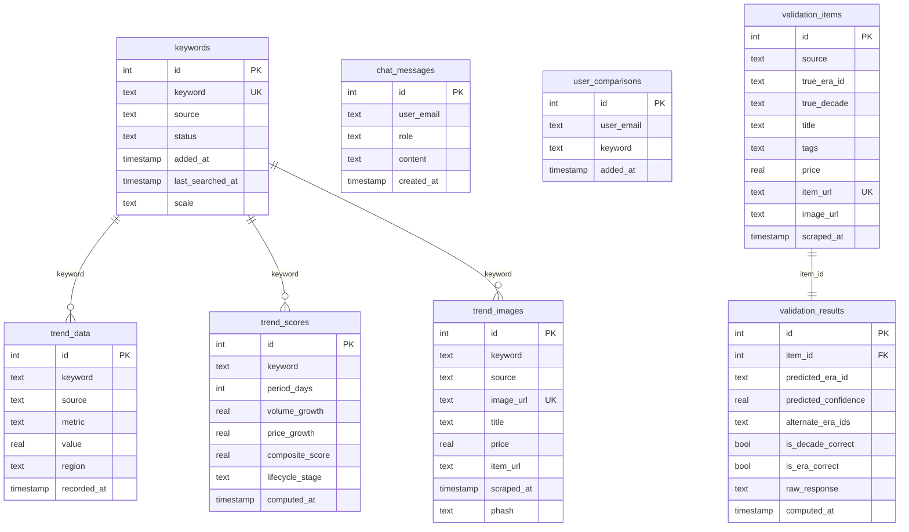
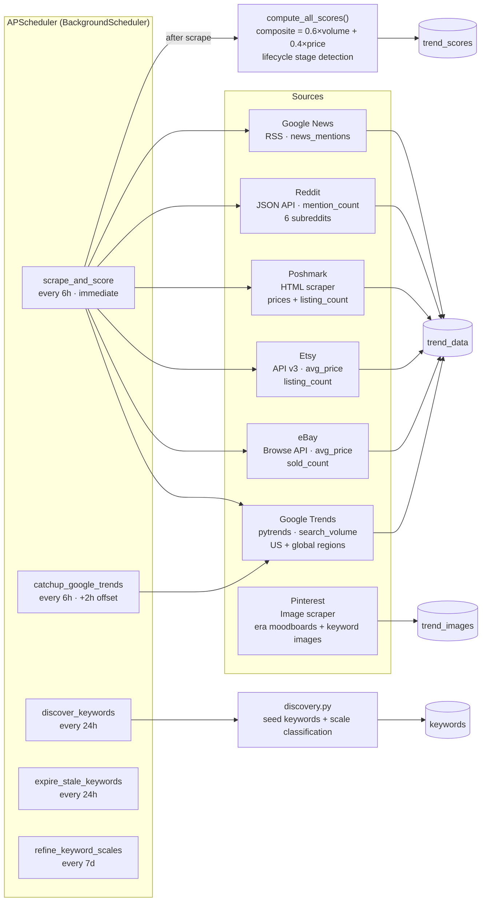
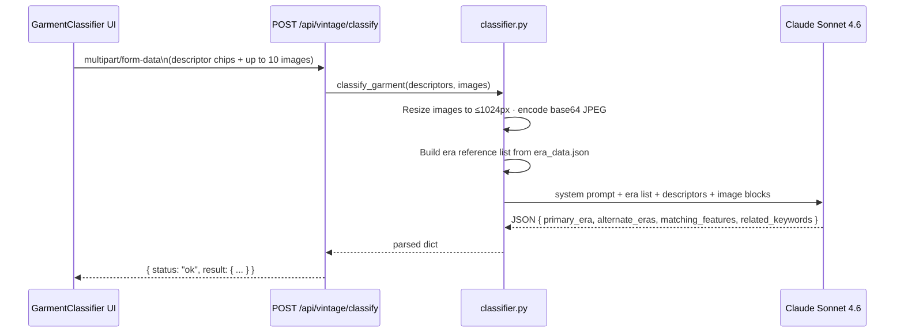

# SYSTEM.md — Fashion Resale Tool

## 1. Overview

A full-stack application that detects and predicts fashion resale trend cycles and classifies vintage garments by era. The system aggregates signals from Google Trends, eBay, Etsy, Poshmark, Reddit, and News to compute composite trend scores, surface the top emerging trends, let users explore any fashion keyword in depth, and identify the historical era of a vintage garment using Claude's vision API.

---

## 2. High-Level Architecture



---

## 3. Frontend

### 3.1 Tech Stack

| Concern | Library |
|---------|---------|
| Framework | React 18 + Vite |
| HTTP client | Axios (with JWT interceptor) |
| Charts | Recharts |
| Styling | Plain CSS (dark theme, CSS Grid/Flexbox) |
| Deployment | Nginx (static serve + `/api` reverse proxy) |

### 3.2 App Routing



### 3.3 Component Tree

```
src/
├── App.jsx                          # Auth routing (public / protected)
├── components/
│   ├── LandingPage.jsx/css          # Login page + preview cards + moodboard carousels
│   ├── HomePage.jsx/css             # Post-login hub with live image carousels
│   ├── Dashboard.jsx/css            # Trend forecast main view
│   ├── TrendCard.jsx/css            # Collapsible trend card (scroll-to-top on expand)
│   ├── TrendDetail.jsx/css          # Expanded view: charts, sourcing, Depop links
│   ├── TrendMoodboard.jsx/css       # Image grid for a trend keyword
│   ├── RankingForecast.jsx/css      # Top 10 + challengers panel
│   ├── CompareSection.jsx/css       # Side-by-side keyword comparison
│   ├── KeywordsPanel.jsx/css        # Add / remove tracked keywords
│   ├── ChatBot.jsx/css              # Stella AI chatbot overlay
│   ├── LifecycleBadge.jsx/css       # Emerging / Peak / Decline badge
│   ├── RegionHeatmap.jsx/css        # US state + global choropleth map
│   ├── TrendCycleIndicator.jsx/css  # Visual lifecycle position indicator
│   ├── CorrelationPanel.jsx         # Correlated keyword panel
│   ├── Charts/                      # Recharts wrappers
│   │   ├── VolumeChart.jsx
│   │   ├── PriceChart.jsx
│   │   ├── SalesVolumeChart.jsx
│   │   ├── SeasonalChart.jsx
│   │   ├── SentimentChart.jsx
│   │   ├── SocialMentionsChart.jsx
│   │   ├── CompareChart.jsx
│   │   ├── SellThroughChart.jsx
│   │   └── VolatilityDisplay.jsx
│   ├── GarmentClassifier/
│   │   ├── GarmentClassifier.jsx/css  # Two-column classifier UI
│   │   └── ValidationPanel.jsx/css    # Accuracy validation panel
│   └── VintageExplorer/
│       ├── VintageExplorer.jsx/css    # Top-level era browser
│       ├── EraSelector.jsx            # Era selector grid
│       ├── EraTrends.jsx              # Era detail: style profile + market data
│       ├── EraImageGrid.jsx           # 6-photo moodboard grid
│       ├── EraBlockGrid.jsx           # Block layout for era sections
│       └── EraBlockEras.jsx           # Related eras blocks
├── hooks/
│   └── useAuth.jsx                  # JWT auth context (login / register / logout)
└── services/
    └── api.js                       # Axios instance, auto-attaches Bearer token
```

### 3.4 Auth Flow



---

## 4. Backend

### 4.1 Tech Stack

| Concern | Library |
|---------|---------|
| Framework | FastAPI 0.115 + Uvicorn |
| Auth | python-jose (JWT HS256) + passlib/bcrypt |
| User store | pandas CSV (`data/users.csv`) |
| Database | SQLite via `sqlite3` (sync) |
| Scheduling | APScheduler 3.10 (BackgroundScheduler) |
| AI | anthropic 0.40 (Claude Sonnet 4.6 + Haiku 4.5) |
| Image processing | Pillow, imagehash |
| Scraping | requests, BeautifulSoup4, pytrends, praw |

### 4.2 Project Structure

```
backend/
├── app/
│   ├── main.py              # FastAPI app, router registration, startup/shutdown
│   ├── config.py            # Settings (env vars via pydantic-settings)
│   ├── database.py          # init_db(), get_connection(), all CREATE TABLE statements
│   ├── auth/
│   │   ├── router.py        # POST /api/auth/register, POST /api/auth/login
│   │   └── service.py       # hash_password, verify_password, create_token, get_current_user
│   ├── trends/
│   │   └── router.py        # All /api/trends/* endpoints
│   ├── chat/
│   │   └── router.py        # POST /api/chat, GET/DELETE /api/chat/history (Stella)
│   ├── vintage/
│   │   ├── router.py        # All /api/vintage/* endpoints
│   │   ├── classifier.py    # classify_garment() → Claude Sonnet 4.6
│   │   ├── validation.py    # Etsy listing search, validation dataset helpers
│   │   └── era_data.json    # 24-era definitions (label, period, colors, fabrics, etc.)
│   ├── scrapers/
│   │   ├── google_trends.py # pytrends wrapper, 3-month backfill, US/global regions
│   │   ├── ebay.py          # eBay Browse API (OAuth), avg price + listing count
│   │   ├── etsy.py          # Etsy API v3, avg price + listing count
│   │   ├── poshmark.py      # Poshmark HTML scraper, listing count + prices
│   │   ├── reddit.py        # Reddit JSON API, mention count per subreddit
│   │   ├── news.py          # Google News RSS, news mention count
│   │   ├── pinterest.py     # Pinterest image scraper (era moodboards + keyword images)
│   │   └── discovery.py     # Auto-discovery: load seed keywords, scale classification
│   └── scheduler/
│       └── jobs.py          # APScheduler job definitions
├── data/
│   ├── trends.db            # SQLite database (Docker volume — persisted)
│   ├── users.csv            # User credentials store
│   └── seed_keywords.json   # Curated seed keyword list
├── requirements.txt
└── Dockerfile
```

### 4.3 Authentication

- **Storage**: `data/users.csv` via pandas — columns: `email`, `hashed_password`, `created_at`
- **Hashing**: bcrypt via passlib
- **Tokens**: JWT (HS256), `python-jose`, 24-hour expiry
- **Dependency**: `get_current_user` FastAPI dependency injected on all protected routes
- **Seed keywords** are `source='seed'` and cannot be deleted (returns 403)

### 4.4 Database Schema



### 4.5 Scraping & Scheduling Pipeline



**Composite Score Formula:**
```
composite_score = 0.6 × volume_growth + 0.4 × price_growth
```

**Lifecycle Stages:** Emerging → Accelerating → Peak → Saturation → Decline → Dormant

**Google Trends Catchup:** On first scrape `pytrends` uses `timeframe="today 3-m"`, returning ~12 weeks of weekly history regardless of when the keyword was added. The `catchup_google_trends` job runs 2 hours after the main scrape to avoid rate-limit collisions and fills in any keywords that returned empty data.

### 4.6 Vintage Module

#### Era Data

- 24 fashion eras defined in `era_data.json`
- Each era has: `id`, `label`, `period`, `colors`, `fabrics`, `silhouettes`, `key_garments`, `brands`, `aesthetics`, `prints`, `hardware`, `embellishments`, `labels`, `image_search_terms`
- `image_search_terms` is stripped from the public API response

#### Garment Classifier



**Inputs:** `fabrics`, `prints`, `silhouettes`, `brands`, `colors`, `aesthetics`, `key_garments`, `hardware`, `embellishments`, `labels`, `notes` (all optional) + up to 10 image files

**Output:**
```json
{
  "primary_era": { "id", "label", "confidence", "reasoning" },
  "alternate_eras": [ { "id", "label", "confidence", "reasoning" }, ... ],
  "matching_features": ["feature 1", "feature 2", ...],
  "related_keywords": ["searchable product term", ...]
}
```

#### Stella Chatbot

- **Model**: `claude-haiku-4-5-20251001`
- **Role**: Fashion trend expert and data analyst — interprets composite scores, lifecycle stages, and market data in plain language
- **Context injection**: The current view's data (keyword, scores, top trends, comparison series) is appended to the last user message before the API call
- **History persistence**: Every exchange (user message + assistant reply) is stored in `chat_messages` and returned on `GET /api/chat/history`

---

## 5. API Endpoints

### Authentication (no auth required)

| Method | Endpoint | Description |
|--------|----------|-------------|
| POST | `/api/auth/register` | Create account, returns JWT |
| POST | `/api/auth/login` | Validate credentials, returns JWT |

### Trends (auth required unless noted)

| Method | Endpoint | Description |
|--------|----------|-------------|
| GET | `/api/trends/top` | Top trends by composite score. `?period=7\|14\|30\|60\|90` |
| GET | `/api/trends/search` | Search a keyword; triggers on-demand scrape if stale. `?keyword=&period=` |
| GET | `/api/trends/ranking-forecast` | Top 10 + challengers forecast. `?period=7` |
| GET | `/api/trends/keywords/list` | All tracked keywords |
| POST | `/api/trends/keywords/{keyword}/track` | Add keyword to tracking |
| DELETE | `/api/trends/keywords/{keyword}` | Remove keyword (seed keywords return 403) |
| GET | `/api/trends/{keyword}/details` | Full time-series detail. `?period=` |
| GET | `/api/trends/{keyword}/seasonal` | Seasonal breakdown |
| GET | `/api/trends/{keyword}/images` | Product images — **public, no auth required** |
| GET | `/api/trends/keywords/{keyword}/sourcing` | AI-generated garments to source (Claude) |

### Chat — Stella (auth required)

| Method | Endpoint | Description |
|--------|----------|-------------|
| POST | `/api/chat` | Send message, receive Stella's reply |
| GET | `/api/chat/history` | Full message history for current user |
| DELETE | `/api/chat/history` | Clear history for current user |

### Vintage (auth required unless noted)

| Method | Endpoint | Description |
|--------|----------|-------------|
| GET | `/api/vintage/eras` | List all 24 eras (id, label, period) |
| GET | `/api/vintage/eras/{era_id}` | Full era detail (strips `image_search_terms`) |
| GET | `/api/vintage/eras/{era_id}/images` | Era moodboard images — **public, no auth required** |
| GET | `/api/vintage/eras/{era_id}/market` | Market pricing data for an era |
| GET | `/api/vintage/descriptor-options` | Chip options for the classifier (aggregated from all eras) |
| POST | `/api/vintage/classify` | Classify garment via Claude Sonnet 4.6 (multipart/form-data) |
| GET | `/api/vintage/etsy-listings` | Etsy listing search. `?q=` |

---

## 6. Docker Compose

```yaml
services:
  frontend:
    build: ./frontend
    ports: [ "80:80" ]
    depends_on: [ backend ]

  backend:
    build: ./backend
    ports: [ "8000:8000" ]
    volumes:
      - backend-data:/app/data   # persists trends.db and users.csv
    environment:
      - JWT_SECRET
      - ANTHROPIC_API_KEY
      - EBAY_APP_ID
      - EBAY_CERT_ID
      - ETSY_API_KEY
      - REDDIT_CLIENT_ID
      - REDDIT_CLIENT_SECRET
      - PEXELS_API_KEY
      - GOOGLE_CSE_API_KEY
      - GOOGLE_CSE_CX

volumes:
  backend-data:
```

---

## 7. Test Suite

All 88 tests live in `tests/` and run inside the backend Docker container against a temporary in-memory SQLite DB (no real API calls made).

```bash
# Install pytest (wiped on container rebuild)
docker exec cs667-backend-1 pip install pytest

# Run all tests
docker exec -w /app cs667-backend-1 python -m pytest tests/ -v
```

| File | Tests | Coverage |
|------|-------|---------|
| `conftest.py` | — | Shared fixtures: `tmp_db`, `tmp_users`, `client` (auth overridden), `raw_client`, `registered_user`, `auth_headers`, `db_rows` helper |
| `test_auth.py` | 17 | Register, login, JWT structure + decode, service layer, protected routes |
| `test_chat.py` | 11 | Send messages, context injection, system prompt ("Stella"), history store/clear |
| `test_scrapers.py` | 14 | Google Trends, eBay, Etsy, Poshmark, Reddit, News — all external calls mocked |
| `test_trends_api.py` | 17 | Top trends, keyword CRUD, search, forecast, details, seasonal, images, sourcing |
| `test_vintage.py` | 29 | Era listing/detail, descriptor options, classify (mocked Claude), market data, Etsy listings |
| **Total** | **88** | 0 failures |

**Key test patterns:**
- External APIs mocked via `unittest.mock.patch` (pytrends, requests, anthropic, urllib)
- `app.dependency_overrides[get_current_user]` bypasses JWT auth in most tests
- `raw_client` fixture preserves real auth for login/register/protected-route tests
- Module-level `DB_PATH` patched to redirect all DB writes to a `tmp_path` per test

---

## 8. Key Design Decisions

| Decision | Rationale |
|----------|-----------|
| **CSV user store** | Simple prototype; no external DB dependency for auth |
| **SQLite over Postgres** | Single-container local deployment; volume-persisted |
| **Seed keywords protected (403 on DELETE)** | Prevents accidental loss of baseline trend data |
| **Google Trends `today 3-m` timeframe** | Always backfills ~12 weeks of history on first scrape |
| **Catchup job offset by +2h** | Avoids hitting Google Trends rate limits immediately after the main scrape job |
| **Image endpoints are public** | Era and keyword moodboard images are shown on the unauthenticated landing page |
| **Claude Sonnet for classifier, Haiku for chat** | Sonnet has better vision/reasoning accuracy; Haiku is faster and cheaper for conversational turns |
| **`phash` deduplication for images** | Perceptual hashing removes visually similar images from the moodboard regardless of different URLs |
| **Sourcing always visible (no toggle)** | Sourcing data loads immediately on keyword selection; no user action required |
